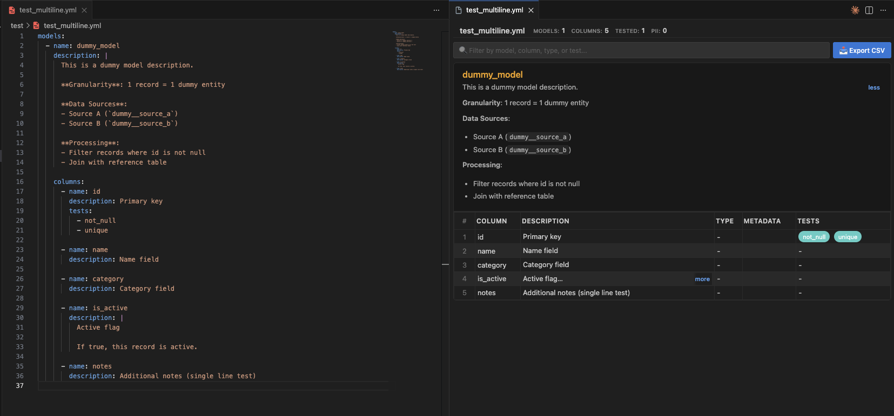

# dbt Column Catalog Preview

VSCode拡張機能：dbt YAMLファイルをインタラクティブなカラムカタログとして表示します。



## 機能

- モデル・列・型・テスト・説明を一覧表示
- Markdown対応の説明文（長い説明は折りたたみ表示）
- リアルタイム検索・ソート
- CSV エクスポート
- PII列のハイライト
- YAMLファイル保存時に自動更新

## 使い方

1. dbt YAMLファイル（`.yml` / `.yaml`）をVSCodeで開く
2. タイトルバーの**テーブルアイコン**をクリック
   - または `Cmd+Shift+P` → `dbt: Preview Column Catalog`

## 設定

```json
{
  "dbtCatalog.autoPreview": false,
  "dbtCatalog.showPiiWarning": true
}
```

## ビルド & パッケージング

```bash
npm install
npm run compile
npx vsce package
```

## ライセンス

MIT
